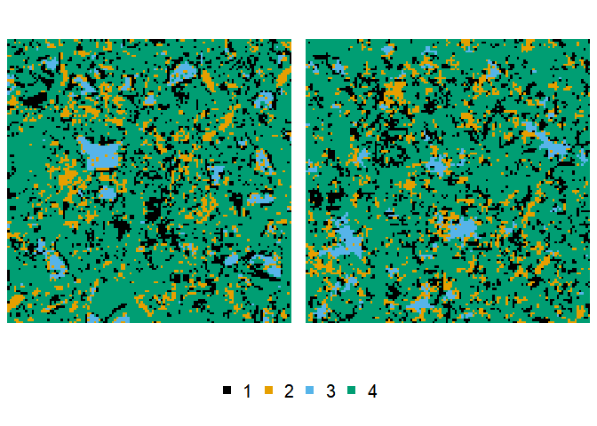

<!-- README.md is generated from README.Rmd. Please edit that file -->

# The {nmhsa} R package<br><small><font color="#999">Nested multiresolution hierarchical simulated annealing</font></small>

<!-- badges: start -->

\[1\] “[](https://cran.r-project.org/web/licenses/MIT)”
\[1\]
“[](https://github.com/rogiersbart/nmhsa)”
\[1\]
“[](https://github.com/rogiersbart/nmhsa)”
\[1\]
“[](https://lifecycle.r-lib.org/articles/stages.html#experimental)”
\[1\]
“[](https://cran.r-project.org/package=nmhsa)”
<!-- badges: end -->

The {[nmhsa](https://rogiersbart.github.io/nmhsa)} R package provides an
R wrapper around the [NMHSA Python
implementation](https://github.com/LaLemmens/NHM-SA) by [Lemmens *et
al.*
(2019)](https://journals.aps.org/pre/abstract/10.1103/PhysRevE.100.053316)
for performing porous media reconstruction using an advanced simulated
annealing approach.

# Install

You can install the latest version of
{[nmhsa](https://rogiersbart.github.io/nmhsa)} with the following:

``` r
if (!require(pak)) install.packages("pak")
pak::pak("rogiersbart/nmhsa")
```

# Use

To run the algorithms from the examples in the original Python code, you
at least need a 2D array as training image, and resort to the `hsa()`,
`mhsa()` or `nmhsa()` functions, through which the algorithms are
exposed to the R user. Hyperparameters and corresponding defaults have
been thorougly revised, so we recommend you read the help pages of these
functions in detail. For making use of the nesting available in
`nmhsa()`, the training image has to be processed, and one or two
modified versions of the image have to be provided as well. Here’s a
minimal `hsa()` example with the `cement` training image provided in the
package:

``` r
library(nmhsa)
#> ! {nmhsa} is still in its experimental lifecycle stage.
#> ! Use at your own risk, and submit issues here:
#> ! <https://github.com/rogiersbart/nmhsa/issues>
reconstruction <- hsa(cement)
#> v Preparing the Python backend ... done
#> v Reconstructing ... done
plot(cement, reconstruction)
```



For more information, refer to `vignette("nmhsa")`.

# Note

This package depends on {reticulate} and Python, and hence a functional
Python installation is required on your machine. If you don’t have
anything like that, {reticulate} will normally solve that for you.
